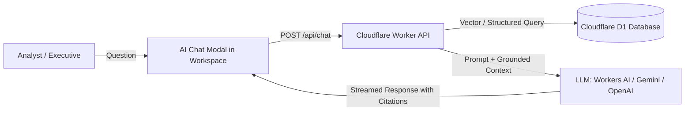
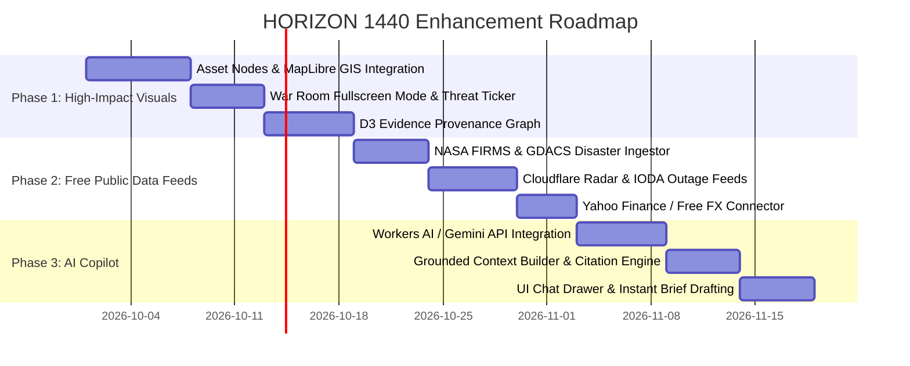

# HORIZON 1440 — Enhancement, Architecture & API Integration Roadmap

---

## 1. Executive Summary

**HORIZON 1440** was exported as a private owner-only analytical pilot for VEON Corporate Affairs across five primary operating markets (**Ukraine, Pakistan, Bangladesh, Kazakhstan, Uzbekistan**) and global situations. 

While the core rule-engine, D1 database schema, and scoring matrices are operational, the external data ingestion layer currently consists of **23 unconfigured stubs**, and the map is limited to basic administrative country boundaries.

This document provides a concrete architectural roadmap to:
1. **Activate the 23 Source Stubs** using verified **free, open, or non-commercial public APIs**.
2. **Transform the UI into a High-Impact War Room & Asset Map** featuring VEON physical asset nodes, incident hotspots, and real-time operational feeds.
3. **Integrate an AI Copilot (Chat with Workspace)** with grounded citations and RAG (Retrieval-Augmented Generation) directly into the Cloudflare Worker architecture.

---

## 2. Free & Open Public APIs for Source Stubs

The project defines 23 source IDs across 8 domains in `lib/horizon/model.ts`. Below is the survey of available free and open API alternatives that can replace the current stubs:

| Domain | Source ID | Seed Name | Free / Open API Alternative | Authentication & Limits |
|---|---|---|---|---|
| **Conflict** | `acled` | ACLED Core / CAST | **[ACLED Access API](https://acleddata.com/data-export-tool/)** | Free registration for research/corporate analysis; JSON endpoint filtering by ISO country code and date window. |
| **Conflict** | `ucdp` | UCDP | **[UCDP API v2.1](https://ucdp.uu.se/apidocs/)** | Completely free, open REST API (`/api/events/24.1`). No API key required. |
| **Conflict** | `gdacs` | GDACS | **[GDACS Live GeoJSON / RSS](https://www.gdacs.org/xml/rss.xml)** | Completely open, no authentication required. Real-time disaster alerts (earthquakes, cyclones, floods). |
| **Aviation** | `gpsjam` | GPSJAM | **[GPSJam Daily Aggregates](https://gpsjam.org/) / FlightAware** | Daily GeoJSON scrape or aircraft ADS-B navigation accuracy degradation reports. |
| **Aviation** | `adsb` | ADS-B Exchange | **[OpenSky Network REST API](https://opensky-network.org/apidoc/)** | Free open REST API (`/api/states/all`), free account offers 4,000 requests/day. Ideal free alternative to ADSBx. |
| **Aviation** | `flightradar` | Flightradar24 | **[AviationStack Free](https://aviationstack.com/)** | Free tier (100 req/mo) or OpenSky airspace bounding boxes for flight density anomalies. |
| **Aviation** | `safeairspace` | Safe Airspace | **[EASA Conflict Zone Information Bulletins (CZIB)](https://www.easa.europa.eu/en/domains/air-operations/czibs)** | Open RSS / JSON feed of active airspace closures (Ukraine, Middle East, Red Sea). |
| **Aviation** | `easa` | EASA CZIB | **[ICAO NOTAMs API / FAA Public API](https://notams.aim.faa.gov/notamSearch/)** | Free public NOTAM search APIs. |
| **Connectivity** | `cloudflare` | Cloudflare Radar | **[Cloudflare Radar API](https://developers.cloudflare.com/radar/api/)** | **Free with Cloudflare API Token** (`/radar/outages`, `/radar/traffic/anomalies`, `/radar/bgp/routing`). |
| **Connectivity** | `ioda` | IODA | **[CAIDA IODA API](https://ioda.inetintel.cc.gatech.edu/)** | Completely free & open JSON API for country/ASN macro-level internet connectivity drops. |
| **Connectivity** | `netblocks` | NetBlocks | **[OONI (Open Observatory of Network Interference) API](https://api.ooni.io/)** | 100% open-source internet censorship & disruption telemetry API. |
| **Earth Obs** | `firms` | NASA FIRMS | **[NASA FIRMS REST API](https://firms.modaps.eosdis.nasa.gov/api/)** | Free API MAP_KEY; live satellite MODIS/VIIRS thermal/fire detection near telecom infrastructure. |
| **Earth Obs** | `copernicus` | Copernicus Sentinel | **[ESA Copernicus Open Access Hub / SentinelHub](https://dataspace.copernicus.eu/)** | Free registration with generous quota for Sentinel-1/2 open satellite telemetry. |
| **Maritime** | `portwatch` | IMF PortWatch | **[IMF PortWatch Portal & Data Hub](https://portwatch.imf.org/)** | Open geospatial data hub tracking shipping volume & disruption in choke points (Suez, Bab el-Mandeb). |
| **Maritime** | `fishingwatch` | Global Fishing Watch | **[GFW Public API](https://globalfishingwatch.org/our-apis/)** | Free registration API for vessel tracking and AIS dark activity in territorial waters. |
| **Media** | `gdelt` | GDELT 2.0 | **[GDELT DOC 2.0 API & GEO API](https://blog.gdeltproject.org/gdelt-doc-2-0-api-debuts/)** | Completely free, open, global news database. Full text search, sentiment, and tone updated every 15 min. |
| **Media** | `crisiswatch` | CrisisWatch | **[Crisis Group RSS / JSON feed](https://www.crisisgroup.org/crisiswatch)** | Open RSS feeds summarizing monthly deteriorations and conflict alerts by country. |
| **Social** | `telegram` | Telegram Channels | **[Telegram Bot API](https://core.telegram.org/bots/api)** | Free API. Monitor verified regional news channels and government emergency broadcasts via MTProto. |
| **Social** | `x` / `meta` | Social content | **[Bluesky Firehose / Reddit Public JSON](https://api.bsky.app/)** | Open free alternatives for social trend detection and early field warning dispatches. |
| **Financial** | `officialfx` | Official Rates | **[Frankfurter API](https://api.frankfurter.dev/) / Open Exchange Rates** | Completely free, open-source European Central Bank & central bank FX rates without API key. |
| **Financial** | `marketdata` | FX / Futures | **[Yahoo Finance API](https://query1.finance.yahoo.com/v8/finance/chart/) / AlphaVantage / TwelveData** | Free tiers for commodities (Brent `BZ=F`, WTI `CL=F`, Gold `GC=F`, EUR/USD `EURUSD=X`). |

---

## 3. War Room & Asset Map Visuals

### 3.1 Architectural Layout (Command Center View)

```
┌────────────────────────────────────────────────────────────────────────────────────────┐
│  HORIZON 1440 WAR ROOM                        [UTC 11:45] [DUBAI 15:45]  [DARK MODE]  │
├───────────────────────────────┬────────────────────────────────────────────────────────┤
│ OPERATIONAL THREAT TICKER:   │  CRITICAL: Kyiv Core DC on backup fuel · PKR -2.1% (5D) │
├───────────────────────────────┼────────────────────────────┬───────────────────────────┤
│ FIVE MARKETS OVERVIEW         │ INTERACTIVE GEOSPATIAL MAP │ LIVE SITUATION MATRIX     │
│  - Ukraine: [SEVERE] (82)     │                            │ ┌───────────────────────┐ │
│  - Pakistan: [WATCH] (38)     │  [MapLibre / Leaflet]      │ │ Situation Dossier     │ │
│  - Bangladesh: [WATCH] (32)   │  • Country Polygons        │ │ Clue Gate: 3/3 Passed │ │
│  - Uzbekistan: [ADVISORY] (18)│  • VEON Key Assets (BSS,DC)│ │ Confidence: 74%       │ │
│  - Kazakhstan: [ADVISORY] (14)│  • NASA FIRMS Fires        │ └───────────────────────┘ │
│                               │  • Conflict Hotspots       │ TREASURY DRILLDOWN        │
├───────────────────────────────┤  • Flight Corridor Delays  │ Brent: $88.40 (+4.2%)     │
│ EVIDENCE PROVENANCE GRAPH     │                            │ EUR/USD: 1.0820           │
│ [D3 Node Network]             │ Layers: [Assets] [FIRMS]   │ FX Stress Indicator: RED  │
└───────────────────────────────┴────────────────────────────┴───────────────────────────┘
```

### 3.2 Visual Components to Add

1. **VEON Asset Node Layer (`/public/data/veon-assets.geojson`)**:
   * Add markers for primary corporate assets:
     * **Kyivstar (Ukraine):** Main Switching Centers (MSCs), core cloud data centers, critical fiber gateways.
     * **Jazz (Pakistan):** Islamabad & Karachi head offices, primary satellite ground stations.
     * **Banglalink (Bangladesh):** Submarine cable landing points (Cox's Bazar, Kuakata).
     * **Beeline (Kazakhstan & Uzbekistan):** Regional central offices and border transmission links.
   * *Status indicators:* Operational (Green), Degraded (Amber), Emergency Power (Red).

2. **Real-time Incident Pinning**:
   * Dynamic markers pulling from GDACS and NASA FIRMS:
     * Flame icons for confirmed heat anomalies within 15 km of network routes.
     * Pulse animation for active internet outage polygons from Cloudflare Radar.

3. **Evidence Lineage Graph (D3.js or Mermaid)**:
   * A visual DAG (Directed Acyclic Graph) showing how raw clues from 3 separate domains connect to an alert candidate to validate the 48-hour gate before approval.

---

## 4. AI Copilot (Chat with Workspace)

### 4.1 Architecture



### 4.2 Key Capabilities

1. **Grounded Querying**:
   * Answers questions strictly based on stored `situations`, `assessments`, `evidence`, and `quotes`.
   * Enforces zero hallucinations: If evidence is missing, the AI explicitly reports `"Insufficient evidence recorded in workspace"`.

2. **Automated Citation Links**:
   * All responses include bracketed citation tags (e.g., `[Evidence: #ev-2026-0928-01]`) that scroll the workspace directly to the corresponding evidence row.

3. **Automated Executive Brief Drafting**:
   * Prompts like: *"Draft a 200-word executive briefing on fuel rationing in Pakistan and its impact on Jazz cellular towers for tomorrow's executive committee"* automatically populate a draft brief record.

---

## 5. Phased Implementation Roadmap


